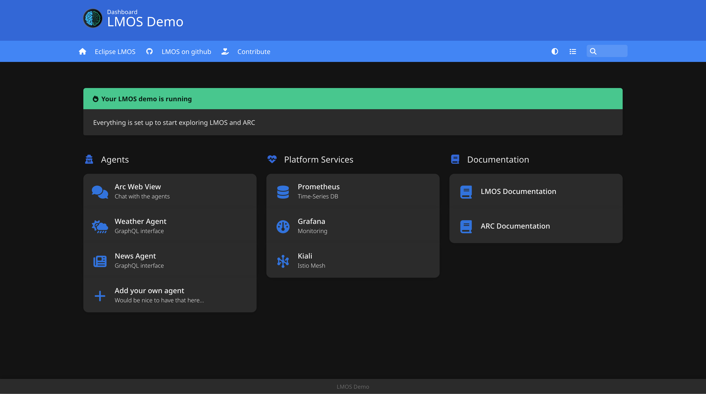

# A dashboard for the LMOS Demo

Draft of a simple dashboard for the [LMOS demo](https://github.com/eclipse-lmos/lmos-demo); the dashboard is built 
using [Homer](https://github.com/bastienwirtz/homer), as it makes the dashboard configurable using a simple yaml file.

The dashboard is provided as a helm chart; the homer configuration is in `config.yml`. Install the helm chart 
and create a port-forward to the dashboard using `install.sh`. The dashboard is then available at 
http://localhost:12345.

Here's a screenshot of the dashboard:

